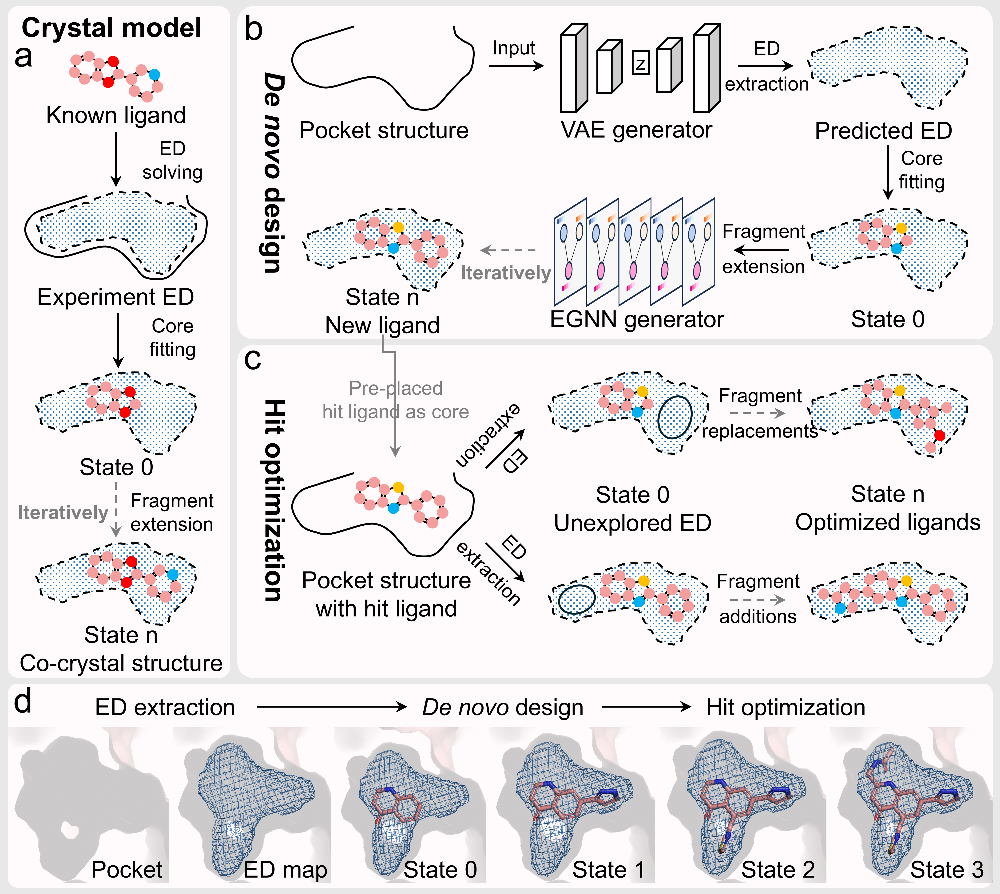

# ED2Mol

<div align=center>

</div>

## Section 1: Setup Environment
You can follow the instructions to setup the environment

We use mamba here. You can install it using `conda install mamba`. If you encounter any errors with mamba, please use conda instead.

1. you can install manually (cuda 11.7)
```shell
mamba create -n ed2mol
mamba activate ed2mol
mamba install install python=3.8.19 pytorch=1.13.1 pytorch-cuda=11.7 rdkit=2023.03.2 plip biopython cctbx-base scikit-learn -y -c pytorch -c nvidia -c conda-forge
pip install torch_geometric==2.3.0
```

2. or you can install via conda yaml file
```shell
mamba env create -f ed2mol_env.yml -n ed2mol
mamba activate ed2mol
```

## Section 2: Weights and Datasets
The model weights can be downloaded at the [release page](https://github.com/pineappleK/ED2Mol/releases/download/v1.0/weights.zip).
```shell
wget https://github.com/pineappleK/ED2Mol/releases/download/v1.0/weights.zip
unzip weights.zip
```

The main data used for training is from [PDB](https://www.rcsb.org) or [ZINC database](https://zinc.docking.org).

For tranining ED extraction model, you can download the [source data](https://doi.org/10.5281/zenodo.14825546) and unzip it.

For training fragment extension model, you can download the [processed data](https://doi.org/10.5281/zenodo.14825546) and unzip it.

## Section 3: Generation

### Run ED2Mol on the test examples
1. Please setup the env dependencies
2. Just change to the base directory and run the `Generate.py` with prepared yml file

**for denovo generation**
```shell
CUDA_VISIBLE_DEVICES="0" python Generate.py --config ./configs/denovo.yml
```

**for hit optimization**
```shell
CUDA_VISIBLE_DEVICES="0" python Generate.py --config ./configs/hitopt.yml
```

### Run ED2Mol on your own targets

For the denovo generation task, prepare your receptor PDB file and modify the example `denovo.yml` file.

- setting the `output_dir` and `receptor` parameters to your designated output path and receptor file.
- specifying the `x`, `y`, and `z` parameters as the center coordinates of the pocket of interest.

For the lead optimization task, you need also prepare a reference ligand core SDF file (Hint: You can use PyMOL to edit, delete, or export the file as an SDF) and modify the example `leadopt.yml` file.
- updating the `reference_core` parameter accordingly.

Then, you can run ED2Mol with your yml file.
```shell
CUDA_VISIBLE_DEVICES="0" python Generate.py --config path-to-your.yml
```


## Section 4: License

MIT